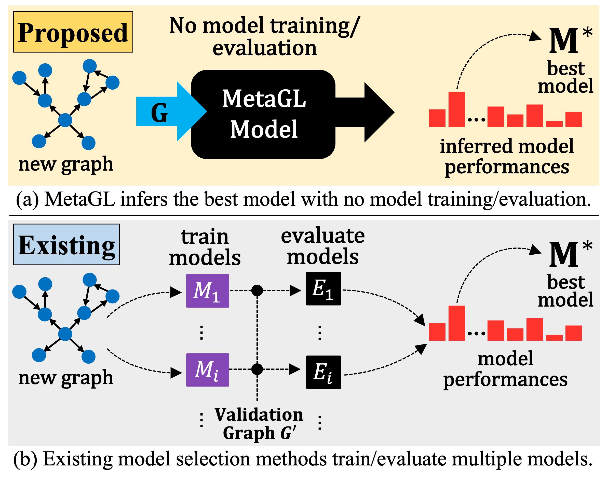

## MetaGL
This repository contains code and data used in the paper ["MetaGL: Evaluation-Free Selection of Graph Learning Models via Meta-Learning"](https://openreview.net/pdf?id=C1ns08q9jZ) (ICLR 2023).

## How to install
Running [install.sh](install/install.sh) will set up the conda environment for MetaGL and install required packages.

## How to run
You can run MetaGL by executing `python main.py`.

## Citation
If you use code or data in this repository, please cite our paper.

    @inproceedings{park2023metagl,
      title={Meta{GL}: Evaluation-Free Selection of Graph Learning Models via Meta-Learning},
      author={Namyong Park and Ryan A. Rossi and Nesreen Ahmed and Christos Faloutsos},
      booktitle={The Eleventh International Conference on Learning Representations},
      year={2023},
      url={https://openreview.net/forum?id=C1ns08q9jZ}
    }
